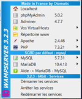
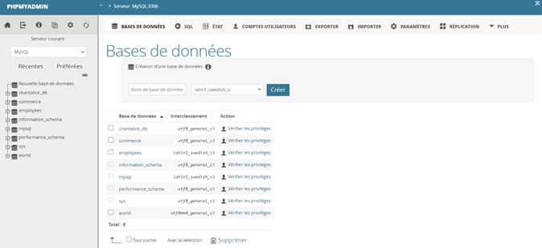
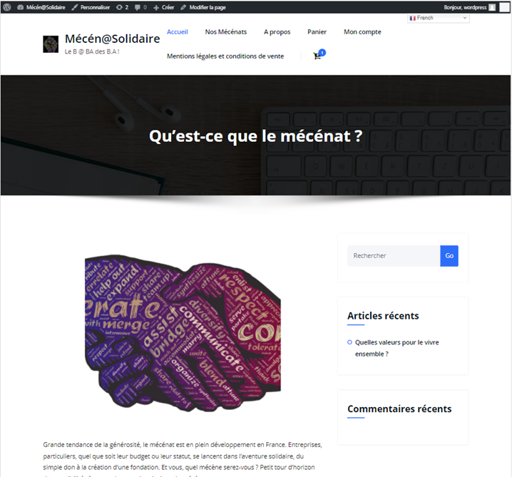
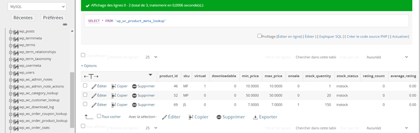

# Boutique E-commerce Wordpress!

**Installation de l’environnement en local** :

1. Installation de WAMPSERVER à faire en tant qu'administrateur et suivre les instructions détaillées sur [https://wampserver.aviatechno.net/?lang=fr&prerequis=afficher](https://wampserver.aviatechno.net/?lang=fr&prerequis=afficher)

	> Etant sous Windows en 64 bit, installation des 2 versions 32 et 64bits.
Les avantages de WAMP : comprend également PHP 7.3.21, PhpMyAdmin 5.0.2, MySQL 5.7.31

2. Installation de WORDPRESS en local : [https://fr.wordpress.org/download/](https://fr.wordpress.org/download/)

- Une fois téléchargé, dézipper l’archive et déplacer le dossier wordpress dans le répertoire www de wamp
- Renommer le dossier avec le nom de votre site, le nom doit être écrit en minuscule sans espace : personnellement je l’ai appelé « commerce » tout simplement !

**Lancer WAMP** :

	> Wamp est en marche quand son logo est vert dans la barre des tâches
		

	> Cliquer sur ce bouton pour obtenir le menu suivant : 

**Créer la base de données grâce à phpmyadmin** :
- Cliquer sur « phpmyadmin » et se connecter : l’utilisateur : root et le mot de passe : (laisser à vide).
- Cliquer ensuite sur « bases de données », puis créez une base de données.
- Ici « commerce » et choisir un interclassement qui va servir pour le codage des caractères : « utf8_general_ci » est le format international, toujours choisir celui-là.
- Cliquer sur créer, la base de données est créée.

**Installer WordPress en local sur Windows** :
- Retour sur l'icône Wamp (verte), cliquer sur localhost ;
- Un onglet s'ouvre dans le navigateur WEB qui fournit des instructions pour installer WordPress. Cliquer sur le bouton C'est parti en bas de page ;
- Renseignez le nom de la base de données (créée dans l'onglet phpMyAdmin), le nom de l'utilisateur, dans notre cas “root”, pas besoin de mot de passe, ni d'adresse pour la base de données. Il n'est pas nécessaire de modifier le préfixe de la table ; cliquer sur Valider ;
- On vous indique que c'est parfait. Cliquer sur Lancer l'installation ;
- Une page s'affiche vous demandant des informations :
> Renseigner le titre de votre futur site WordPress. Il s'affichera dans l'interface d'admin de WordPress, sur la page d'accueil du site et dans l'élément <title> du code source de vos pages Web ;
	
> Compléter le champ Nom d'utilisateur et le champ Mot de passe pour vous créer un profil utilisateur et accédez à l'admin de votre site Web ;

> Insérer votre adresse mail pour recevoir les notifications d'activités de votre site et le lien de renouvellement de mot de passe. Cette fonction sera opérationnelle lorsque votre site sera en ligne et que votre hébergeur autorise la fonction email sur votre serveur ;

> Il n'est pas utile de cocher la case de visibilité auprès des moteurs de recherche. Nous sommes en local ;

- Cliquer sur Installer ;
- Cliquer sur Se connecter et renseigner vos identifiant et mot de passe ;
- Vous avez désormais accès à l'admin : pour visualiser votre site WordPress en local, cliquez sur le nom de votre site situé en haut à gauche dans la barre noire de l'administration.

Pour construire mon site,
1. j’ai choisi
- un thème : Honeypress
- un plugin e-commerce : WooCommerce
- un plugin SEO : The SEO Framework
- un plugin Multilingue : GTranslate
- un plugin RGPD (Règlement Général pour la Protection des Données) : GDPR Cookie Consent

2. j’ai donné un intitulé à mon site « Mécén@Solidaire – le B @ BA des B.A. ! »

3. je lui ai attribué un logo

4. j’ai créé ou modifier les pages proposées afin d’intégrer notamment :
- une page produits « Nos mécénats » : 3 produits dans une catégorie « Mécénat de compétences » : ces produits seront automatiquement enregistrés dans ma base de données :

- une page « Mentions légales et conditions de vente »

Crédit Images Pixabay.

